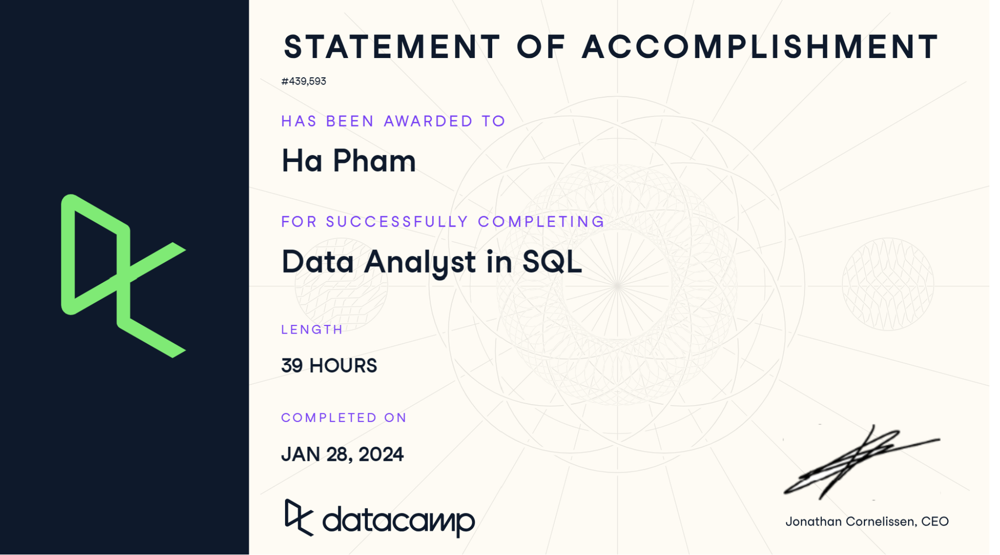

### My certificate 

## Data Analyst in SQL - DataCamp Track 
Effective database design is essential for optimizing the performance of applications. Just as constructing a house requires a blueprint, careful planning of data storage is necessary. This interactive SQL track focuses on teaching the fundamental principles of database design, enabling participants to:
- Formulate basic SQL queries
- Employ grouping and aggregation for generating summary statistics
- Utilize table joins, apply filters, and implement sub-queries
- Develop functions to explore and manipulate data
### The track includes serveral courses that require almost 40 hours of learning:
1. **Introduction and Intermediate to SQL**
2. **Joining Data in SQL**
3. **Data Manipulation in SQL**
4. **Windows Funstion in SQL**
5. **Exploratory Data Analysis in SQL**
6. **Data Communication Concepts**
7. **Introduction to Statistics** 

